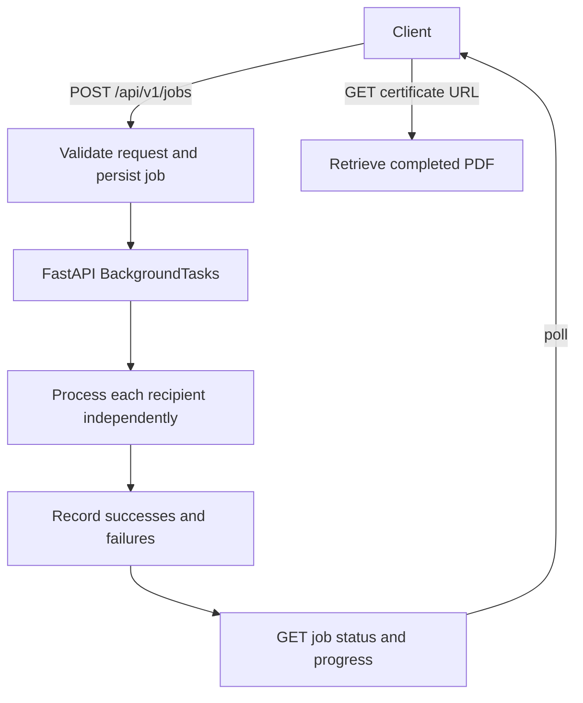

# Bulk Certificate Generator API

## Overview

A FastAPI backend that accepts bulk certificate-generation requests, validates recipients, generates PDFs in the background, tracks job progress, isolates individual failures, and provides endpoints to retrieve completed certificates.

## Features

- Bulk certificate-generation jobs with request validation
- Background processing using FastAPI `BackgroundTasks`
- Job status and progress tracking
- Independent per-recipient failure handling
- PDF generation with one predefined certificate design
- Certificate listing and PDF retrieval
- SQLite persistence through SQLAlchemy
- Swagger UI and OpenAPI documentation
- Automated tests
- Dockerfile and Docker Compose configuration

## Technology Stack

| Area | Technology |
| --- | --- |
| Language | Python 3.12+ |
| API framework | FastAPI |
| Validation and schemas | Pydantic |
| Persistence | SQLAlchemy 2, SQLite by default |
| PDF generation | ReportLab |
| Tests | pytest, Starlette `TestClient` with the `httpx2` transport |
| ASGI server | Uvicorn |
| Container support | Docker, Docker Compose |

## Project Structure

```text
.
├── app/
│   ├── api/routes.py
│   ├── services/
│   │   ├── job_service.py
│   │   └── certificate_service.py
│   ├── config.py
│   ├── database.py
│   ├── models.py
│   ├── schemas.py
│   └── main.py
├── storage/certificates/.gitkeep
├── tests/
├── .env.example
├── .gitignore
├── Dockerfile
├── docker-compose.yml
├── requirements.txt
├── requirements-dev.txt
└── README.md
```

`app/api/routes.py` defines the HTTP endpoints. `app/services/job_service.py` processes recipient records and updates job counts. `app/services/certificate_service.py` creates and stores PDFs. `app/models.py` defines the job and certificate tables; `app/schemas.py` defines request and response validation. Tests use an isolated SQLite database and temporary certificate storage.

## Architecture



The API validates and stores a job and its recipient records before scheduling certificate generation. The background function uses separate database sessions, processes each recipient independently, and records each result. Clients can poll the job-status endpoint and retrieve PDFs for successful recipients.

## Why BackgroundTasks?

`POST /api/v1/jobs` returns HTTP `202 Accepted` after the job and recipient records are saved. FastAPI `BackgroundTasks` then continues certificate generation in the API process while the client can poll `GET /api/v1/jobs/{job_id}` for progress and results.

`BackgroundTasks` was selected because the assignment does not require distributed workers. It keeps the project simple and self-contained without unnecessary infrastructure. It is not a durable job queue, and processing can be lost if the API process stops. A larger production deployment could later introduce a dedicated task queue and worker system.

## Failure Isolation

Recipients are processed independently. A failed PDF does not stop the remaining recipients, and the job records successful and failed generations separately.

For example, with five recipients, if four certificates succeed and one fails, the four successful PDFs remain available and the job finishes with `completed_with_errors`.

## API Endpoints

| Method | Path | Purpose and request | Important responses |
| --- | --- | --- | --- |
| `GET` | `/health` | Health check | `200 OK` |
| `GET` | `/docs` | Interactive Swagger UI | `200 OK` |
| `GET` | `/openapi.json` | OpenAPI schema | `200 OK` |
| `POST` | `/api/v1/jobs` | Create a job. JSON body fields: `event_name`, `organization`, `certificate_date`, and `recipients` (each with `name` and `email`). | `202 Accepted`; `422` for invalid input |
| `GET` | `/api/v1/jobs/{job_id}` | Read job status, counts, and progress | `200 OK`; `404` if missing |
| `GET` | `/api/v1/jobs/{job_id}/certificates` | List recipient outcomes and successful download URLs | `200 OK`; `404` if the job is missing |
| `GET` | `/api/v1/certificates/{certificate_id}` | Download a completed certificate PDF | `200 OK`; `404` if missing; `409` while pending/processing; `422` if generation failed |

Successful job status responses include `total`, `successful`, `failed`, `pending`, `progress_percentage`, and timestamps. Certificate-list responses include a download URL for completed certificates or an error message for failed ones.

## API Usage

Check the service health:

```bash
curl -i "http://localhost:8000/health"
```

Create a job:

```bash
curl -X POST "http://localhost:8000/api/v1/jobs" \
  -H "Content-Type: application/json" \
  -d '{
    "event_name": "Python Backend Workshop",
    "organization": "Example Institute",
    "certificate_date": "2026-10-07",
    "recipients": [
      {"name": "Arun Kumar", "email": "arun@example.com"},
      {"name": "Priya Devi", "email": "priya@example.com"}
    ]
  }'
```

The `202 Accepted` response contains `job_id`, `status`, and `total`. Use the returned ID to poll status and list recipient results:

```bash
curl "http://localhost:8000/api/v1/jobs/JOB_ID"
curl "http://localhost:8000/api/v1/jobs/JOB_ID/certificates"
```

Download a completed certificate using its `certificate_id`:

```bash
curl -L \
  "http://localhost:8000/api/v1/certificates/CERTIFICATE_ID" \
  -o certificate.pdf
```

## Swagger and OpenAPI

After starting the server, interactive API documentation is available at [http://localhost:8000/docs](http://localhost:8000/docs). The OpenAPI document is available at [http://localhost:8000/openapi.json](http://localhost:8000/openapi.json).

## Local Setup

Use Python 3.12 or newer. From the repository root:

```bash
python -m venv .venv
```

Activate the environment:

```bash
# macOS/Linux
source .venv/bin/activate

# Windows PowerShell
.venv\Scripts\Activate.ps1
```

Install runtime dependencies. For development and tests, install the development requirements as well:

```bash
python -m pip install -r requirements.txt
python -m pip install -r requirements-dev.txt
```

The application reads environment variables directly; `.env.example` documents supported settings but is not loaded automatically. Defaults work without an environment file.

Run the API:

```bash
uvicorn app.main:app --host 0.0.0.0 --port 8000
```

Check the service at `http://localhost:8000/health` and open Swagger at `http://localhost:8000/docs`.

## Environment Variables

| Variable | Default | Description |
| --- | --- | --- |
| `DATABASE_URL` | `sqlite:///./bulk_certificates.db` | SQLAlchemy database URL |
| `STORAGE_DIR` | `storage/certificates` | Directory for generated PDFs |
| `MAX_BATCH_SIZE` | `500` | Maximum number of recipients per request |

## Testing

Run the automated tests with:

```bash
pytest -q
```

**Verified result: 20 tests passed.** The tests cover job creation and progress, validation and batch limits, PDF generation and retrieval, missing resources, SQLite foreign-key cascading, and a failed recipient alongside successful recipients.

## Docker

The `Dockerfile` and `docker-compose.yml` are included. With Docker Engine and the Docker Compose plugin installed, start the service from the repository root:

```bash
docker compose up --build
```

The API is available at `http://localhost:8000`. Compose uses named volumes for the database and generated certificates. Stop the service with `Ctrl+C`, then run:

```bash
docker compose down
```

Named volumes remain after `docker compose down`; `docker compose down -v` removes them and deletes the stored database and certificates.

## Database

SQLite is the default relational database, and SQLAlchemy handles persistence. Set `DATABASE_URL` to a PostgreSQL URL to use PostgreSQL with the included `psycopg` driver.

## Certificate Generation

The service uses ReportLab to create one predefined landscape PDF design. Each certificate includes the organization, event name, recipient name, issue date, and a short certificate ID. Filenames are generated by the server; recipient data is not used as a filesystem path.

## Validation and Error Handling

The request requires an event name, organization, ISO-formatted certificate date, and at least one recipient. Event and organization text must be nonblank and no longer than 120 characters. Recipient names must be nonblank and no longer than 150 characters; recipient emails are validated. The default maximum batch size is 500. Unknown request fields and control characters in required text are rejected.

Invalid requests return `422 Unprocessable Entity`. Missing jobs, certificates, or files return `404 Not Found`. Downloading a certificate that is still pending or processing returns `409 Conflict`; a certificate whose generation failed returns `422 Unprocessable Entity`. Internal tracebacks and filesystem paths are not returned to API clients.

## Design Decisions

- **FastAPI:** supplies request handling, validation integration, background tasks, and OpenAPI documentation.
- **SQLAlchemy:** keeps persistence organized around relational job and certificate models.
- **SQLite:** provides a self-contained default for local use and tests; the schema is intended to be portable to PostgreSQL.
- **BackgroundTasks:** avoids adding a separate worker service to this assignment.
- **Validation:** Pydantic schemas validate job and recipient data before processing.
- **Job tracking:** persisted job and recipient records report status, progress, and separate success and failure counts.
- **Certificate template:** a fixed, predefined layout keeps generated certificates consistent.
- **Local certificate storage:** generated PDFs are stored on the filesystem and retrieved through the API.
- **ReportLab:** generates PDFs without downloaded assets.
- **Per-recipient processing:** allows successful certificates to remain available when another recipient fails.

## Limitations and Future Production Improvements

- Background processing runs in the API process and is not durable across process restarts.
- Authentication is intentionally not implemented because it was outside the assignment requirements.
- A larger production deployment could use a dedicated task queue and worker system, PostgreSQL, and object storage for generated certificates.

## Assignment Coverage

- [x] Bulk generation
- [x] Input validation
- [x] PDF certificate generation
- [x] Job status and progress
- [x] Per-recipient failure isolation
- [x] Certificate retrieval
- [x] Automated tests
- [x] API documentation
